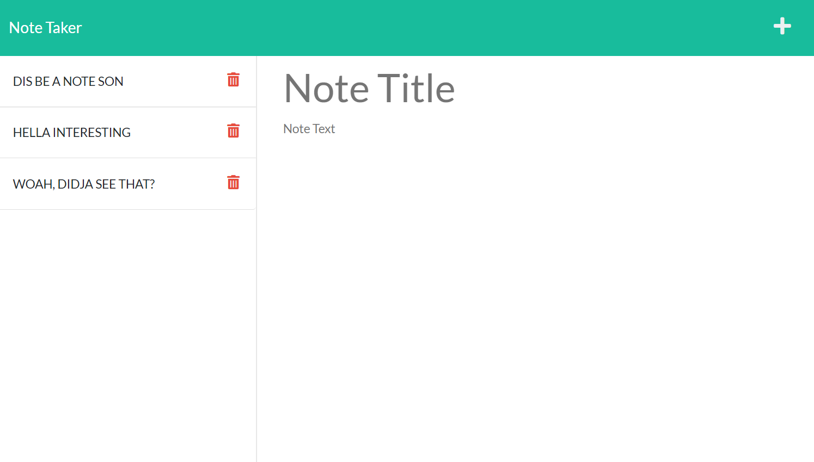

# Note Taker
[](https://opensource.org/licenses/MIT)

## Description

This is a browser based application for taking, storing and managing notes. 

https://jkw-note-taker.herokuapp.com/

[](https://jkw-note-taker.herokuapp.com/)

  ## Table Of Contents

* [Installation](#!installation)

* [Usage](#usage)

* [License](#license)

* [Contributing](#contributing)

* [Tests](#tests)

* [Questions](#questions)

================================================

## Installation

To install the necessary dependencies, please run the following command:

```
npm i
```

================================================

## Usage

Nothing

================================================

## License

This project is licensed under the MIT license.

================================================

## Contributing

Nothing

================================================

## Tests

To test if the dependencies are all installed, please run the following command:

```
npm test
```

================================================

## Questions

If you have any questions please reach out to me [HERE](mailto:josh@joshwatkins.photo). You can find more of my work at [MY GITHUB](https://www.github.com/joshuakwatkins/).


